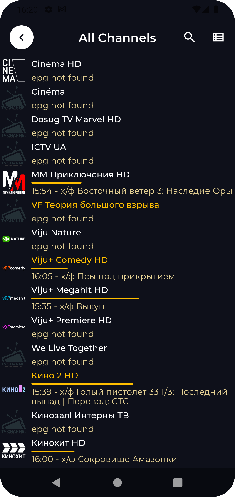
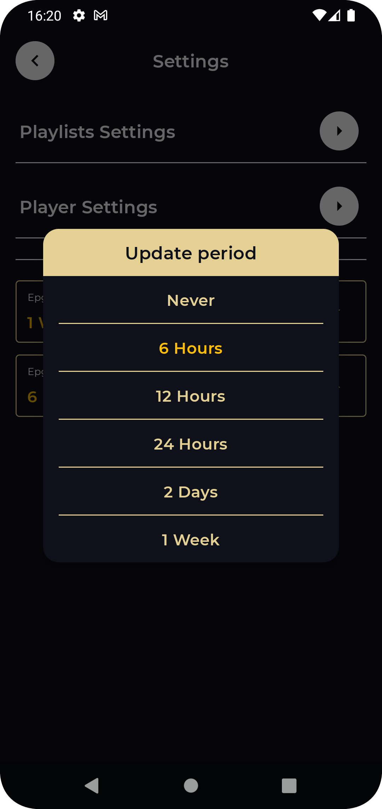
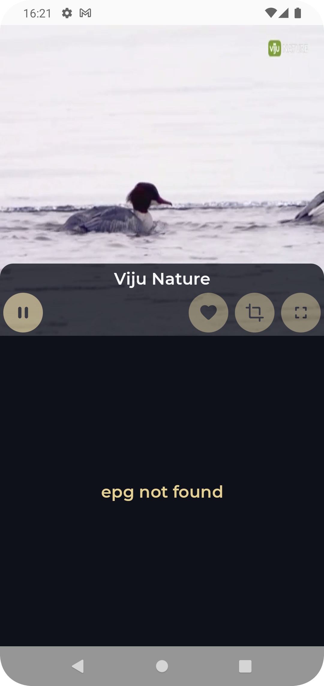

# Tiny Iptv Player

Android video player based on [Media3](https://github.com/androidx/media)

It uses ExoPlayer's ``ffmpeg`` extension
with [all its audio formats](https://exoplayer.dev/supported-formats.html#ffmpeg-extension)
enabled (it can handle even special formats like AC3, EAC3, DTS, DTS HD, TrueHD etc.).

## Features

* Support m3u/m3u8 playlists local and remote
* Epg provider
* Horizontal swipe to change current playing channels
* Vertical swipe to change brightness (left) / volume (right)
* Resize (fit/crop)
* Scheduling updates for channels and epg

## UI

#### Compose(https://developer.android.com/jetpack/compose)

Tiny Iptv Player is fully written with Compose, using AndroidView in some cases

## Networking

#### [Ktor](https://ktor.io/)

Tiny Iptv Player use for requests for playlist and epg data and parse responses

## Navigation

#### [Voyager](https://voyager.adriel.cafe/)

A multiplatform navigation library built for Compose

## Database

#### [SQLDelight](https://cashapp.github.io/sqldelight/1.5.4/)

SQLDelight generates typesafe kotlin APIs from your SQL statements. It verifies your schema,
statements, and migrations at compile-time and provides IDE features like autocomplete and
refactoring which make writing and maintaining SQL simple.

## DI

#### [Koin](https://insert-koin.io/)

The pragmatic Kotlin & Kotlin Multiplatform Dependency Injection framework

## Theming

#### [Material 3 Theming](https://m3.material.io/develop/android/mdc-android)

Tiny Iptv Player is using brand new Material 3. It also supports both light and dark mode depending
on system settings.
[Material Theme builder](https://material-foundation.github.io/material-theme-builder/#/custom) is
used to create material 3 theme and directly export it for Compose.

## Screenshots

